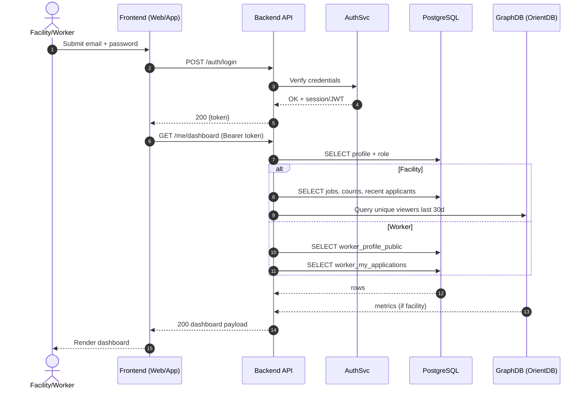
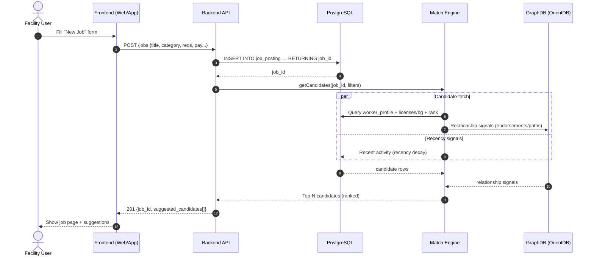
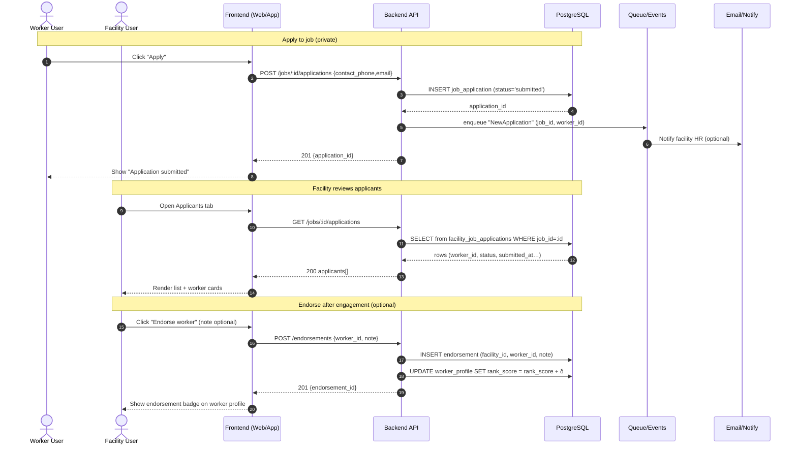

# MedPost — Key Interaction Flows

This README documents three critical MedPost use cases with **Mermaid sequence diagrams**.  
They cover login & dashboard loading, posting a job with instant candidate suggestions, and the end-to-end apply/review/endorse flow.

> Rendering: GitHub, GitLab, and many Markdown previewers render Mermaid automatically. In VS Code, use a Mermaid-enabled preview extension if needed.

---

## 1) Login → Load Dashboard (retrieve data)

---

## 2) Facility Posts a Job (save new record) + Instant Candidate Suggestions

---

## 3) Worker Applies → Facility Reviews Applicants → Endorsement (updates rank)

